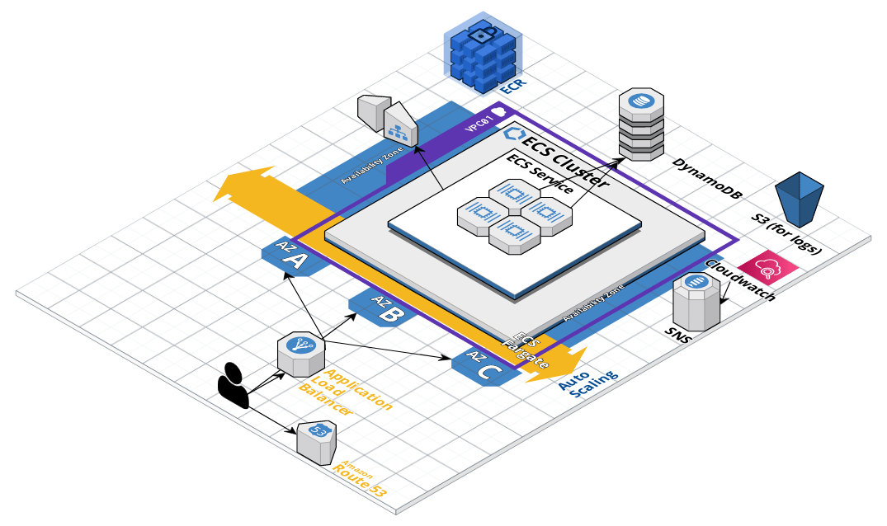

# Infra Scripting Challenge

# Results

[The webapp](http://alb-1580287575.us-west-2.elb.amazonaws.com/)



# Pre-Conditions

- I created an Administrator account in IAM via the console, by hand. That ARN is hard-coded in a couple of places. This is not best-practice but it got this project running quickly.
- I wasn't quite sure how to satisfy the requirement "ECS with EC2 and Fargate". My ECS cluster uses the FARGATE provider, so there's no EC2 instances to manage here.

# Requirements

 - Terraform v1.4.4
 - Terragrunt v0.45.2

# Howto

```
> git clone git@github.com:grggls/infra-scripting-interview.git
> cd ./infra-scripting-interview/terragrunt
> terragrunt run-all init
> terragrunt run-all apply
```

In a fresh AWS account this will run partially and generate some errors. The initial layer of dependencies - VPC, DynamoDB (for tfstate locking and for application data) and ECR should build without error. Once the ECR repo is created, pause with Terragrunt and return to the root of the directory and do some docker work:

```
> cd ../docker && pwd
/Users/gregorydamiani/src/infra-scripting-interview/docker
> ./build-and-push.sh
```

The `app` ECR repo is now populated with a new container image with the `latest` tag. That's what we need to deploy a task to the ECS cluster. A brief note on security - this is the only place that we tolerate "latest" or unbounded version constraints in this project. Terraform modules, python libraries, and tooling version constraints should all be in place.

Return to the terragrunt directory and continue to `terragrunt run-all apply` repeatedly until the infrastructure converges.

You can then navigate to the DynamoDB section of the AWS console, go into the `dynamodb01` table, and add some items for your webapp to transmit to the world.

# Dependencies

I made heavy use of the [Cloudposse terraform modules](https://registry.terraform.io/namespaces/cloudposse). One in particular did 90% of the heavy lifting here - https://registry.terraform.io/modules/cloudposse/ecs-web-app/aws/1.8.1

That module needed a slight tweak in order to make it work in this multi-directory terragrunt setup I've built. As a result, the whole of the module's code and config has been copied to `./infra-scripting-interview/terragrunt/modules/terraform-aws-ecs-web-app` and tweaked slightly.

This module created all the Cloudwatch alarms enabled in the webapp:

|Name | Conditions |
|-----|------------|
|app-3xx-count-high | HTTPCode_Target_3XX_Count > 25 for 1 datapoints within 5 minutes |
|app-4xx-count-high | HTTPCode_Target_4XX_Count > 25 for 1 datapoints within 5 minutes |
|app-5xx-count-high | HTTPCode_Target_5XX_Count > 25 for 1 datapoints within 5 minutes |
|app-cpu-utilization-high | CPUUtilization > 80 for 1 datapoints within 5 minutes |
|app-cpu-utilization-low | CPUUtilization < 20 for 1 datapoints within 5 minutes |
|app-elb-5xx-count-high | HTTPCode_ELB_5XX_Count > 25 for 1 datapoints within 5 minutes |
|app-memory-utilization-high | MemoryUtilization > 80 for 1 datapoints within 5 minutes |
|app-memory-utilization-low | MemoryUtilization < 20 for 1 datapoints within 5 minutes |
|app-target-response-high | TargetResponseTime > 0.5 for 1 datapoints within 5 minutes |

The `app-{3,4,5}xx-count-high` alarms are important for every webapp to have. 

500-level HTTP errors are server-side error codes that indicate a problem with the server processing a client's request. These errors occur when the server fails to fulfill a valid request due to various reasons, such as unexpected conditions, server misconfigurations, or application errors. 500-level errors are indicative of problems with hosts, networking, or proxies and can be generated if the Flask app itself has a problem, such as an uncaught exception. We also have `app-elb-5xx-count-high` alarms setup on the ALB to indicate if there are no valid upstream targets to route a request to due to capacity or app downtime. To diagnose any of these conditions in production, it's important to have proper logging at all levels: load-balancer, container runtime and networking, and inside the container itself. Ideally, for more complicated apps, distributed tracing would be in place to show us how requests, latency, and error conditions move around a microservices architecture.

Monitoring 400-level HTTP error codes is crucial for maintaining the health and usability of a web application. These client-side errors help identify issues with user requests, such as incorrect URLs, missing or invalid data, and authentication problems. By monitoring and analyzing these errors, developers can uncover and fix problems in the application, improve user experience, and prevent potential security vulnerabilities Our Flask app responds on two paths: `/` and `/health`. Clients requesting other URLs are misconfigured or malicious. Either way, being notified of increased levels of these errors is crucial.

Monitoring 300-level HTTP status codes is important for managing and optimizing the flow of web traffic, especially in complex and changing web applications. These redirection codes indicate that a requested resource has moved or is accessible through multiple representations. By monitoring 300-level codes, developers can ensure that URL redirections are functioning correctly, maintain the integrity of internal and external links, and improve the overall user experience by minimizing confusion and broken links. For a simple webapp like ours, this cloudwatch alarm isn't necessarily critical.

Our `app-cpu-utilization-high` Cloudwatch alarm is necessary to alert operators when running containers are constrained by CPU over-utilization. It's also tied to our container autoscaling group. New containers will be created and will service requests coming from the load balancer if these threshold is crossed. `app-cpu-utilization-low` will trigger a scale-down of the container fleet.

`app-target-response-high` will alert operators when request latency is spiking within the webapp. We don't utilize this metric for autoscaling considerations, however, as this can lead to drastic scaling out of the container fleet when there is a misconfiguration or application problem, or if the backend (in our case DynamoDB) is over-utilized and suffering from latency problems. In these cases, more containers serving more requests is not the solution.

Finally, `app-memory-utilization-{high,low}` Cloudwatch alarms are created for monitoring memory utilization. Monitoring memory utilization in a container-based web app is crucial for ensuring optimal performance, stability, and resource efficiency. High memory utilization can lead to performance degradation, increased latency, and application crashes or container-runtime events like `oom-killed`, impacting user experience and potentially causing downtime. On the other hand, low memory utilization might indicate underutilization of resources or over-provisioning, leading to inefficient resource allocation and higher infrastructure costs. By monitoring memory usage, developers can identify bottlenecks, optimize resource allocation, and make necessary adjustments to maintain a stable and cost-effective environment.

# Objective

- [x]  Create an AWS account and use the free tier to provision the required elements.
- [x]  Generate a VPC (VPC01) with public and private subnets, and the required subnets elements (Route tables, Internet gateways, NAT or instance gateways, etc)
- [x]  Provision an application using ECS with EC2 and Fargate with the following elements:
    - [x]  public component
    - [x]  private component
    - [x]  database component
- [x]  all the required elements (security groups, roles, log groups, etc). The components must be interconnected, so for example the public layer must connect to the application layer and the application layer must connect to the database layer.
- [x]  A load balancer with target and auto-scalation groups must be utilized for each layer.
- [x]  For the database layer, please use an AWS managed service.
- [x]  Expose the application to Internet using a load balancer of the type you consider the best for this kind of implementation.
- [x]  No need to assign a domain name or TLS certificates, but explanation of what is required to do it will be necessary.
- [x]  Select and add five CloudWatch alarms related to the implementation.
- [x]  We will require explanation about the reasons of the selected alarms.
- [x]  A diagram with the implementation is required.
- [x]  The candidate can implement the requested elements manually using the AWS console, but extra points are earned if you use some infrastructure as code technology.
